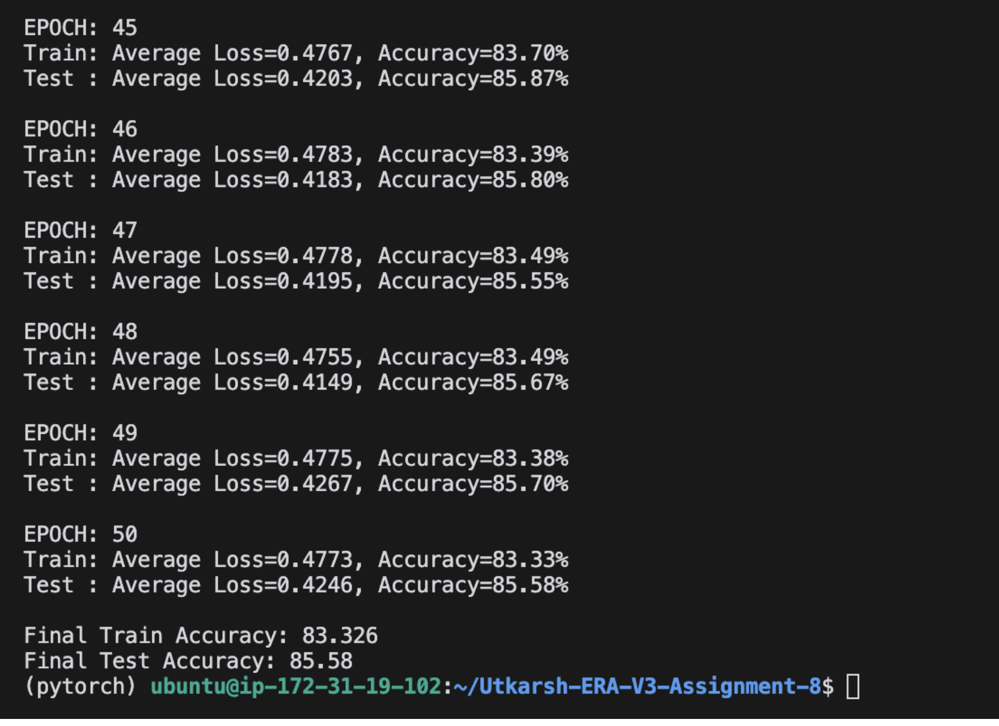
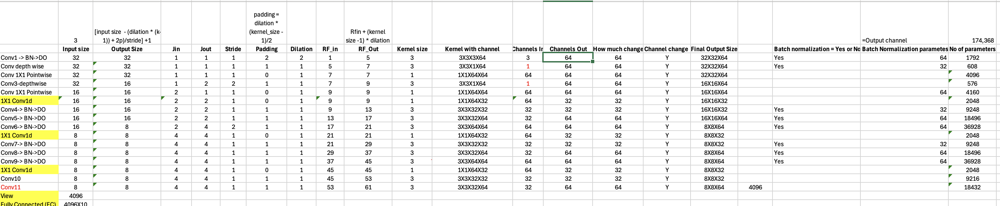

# Neural Network Models for CIFAR10

This repository contains various neural network model implementations for the CIFAR10 dataset using PyTorch.

## Project Structure

### Layer Configuration
[Insert your Excel screenshot showing the detailed layer configuration]

## Training Configuration
- Batch Size: 64
- Optimizer: SGD with momentum (0.9)
- Initial Learning Rate: 0.01
- Scheduler: StepLR (step_size=25, gamma=0.1)
- Loss Function: Negative Log Likelihood

## Data Augmentation
- Horizontal Flip (p=0.5)
- ShiftScaleRotate
  - shift_limit: 0.1
  - scale_limit: 0.1
  - rotate_limit: 15°
- Normalization
  - mean: (0.4914, 0.4822, 0.4465)
  - std: (0.2470, 0.2435, 0.2616)

## Results

## Model Architecture Visualization
